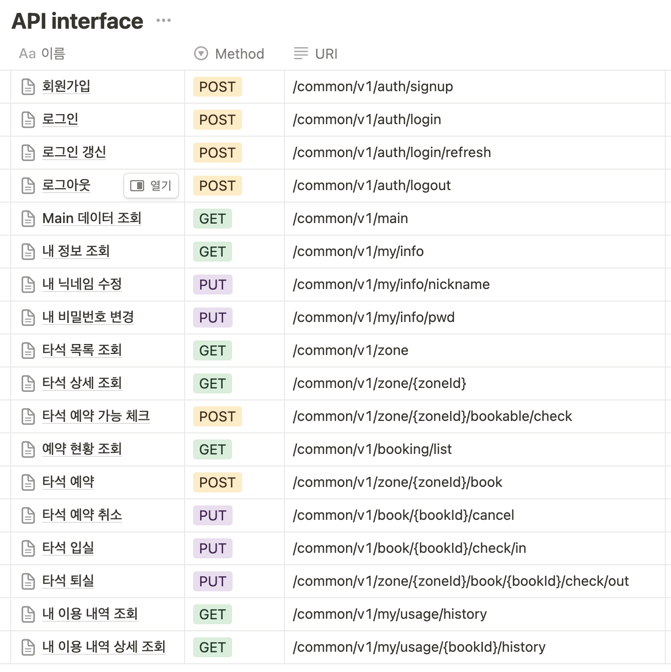

[//]: # (# SwingLab)

특정 회원을 위한 스크린 골프 연습장 예약 시스템 Web Server입니다.  
JPA 학습용으로 간단히 개발한 프로젝트입니다.  
총 개발 인원 : FE 1명 BE 1명 / 개발 일정 : 약 2주

## 🛠️ Stack

 

 

## ⭐️ Feature

- Spring security JWT 인증 방식을 통해 로그인 기능을 구현했습니다.
- 특정 타석을 원하는 시간에 예약 가능한 지 미리 확인할 수 있습니다.
- 예약 시간 10분 전까지는 예약을 취소할 수 있습니다.
- 예약 시간 10이 지난 후에도 입실하지 않은 경우 해당 예약 건은 자동 취소됩니다.
- 나의 예약 및 입/퇴실 등 전체 이용 내역 조회를 할 수 있습니다.

## 🔥 After Plan

1. 티켓(회원권),타석,회원 등을 관리 할 수 있는 운영 시스템 개발
2. 예약,입/퇴실 시 앱 푸쉬 알림 기능 개발
3. QR Code를 통한 입/퇴실 기능
4. 상습적 노쇼 회원 계정 잠금 기능

## 🖥️ Demo
